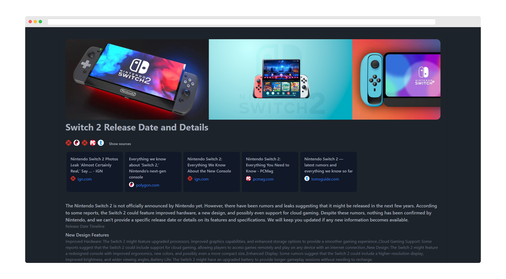

# Browse for Me

This is a very early clone of the [Arc Search](https://arc.net/search) _Browse for Me_ feature. It is a simple python script that uses Ollama and DuckDuckGo to search for a query and generate a report of the results.

## Features

*Note: This is a very early version of the script and it is not yet fully functional.*

- Generate a report
- Show images
- Show the sources

## Installation

1. Clone the repository
1. Install the requirements *AND* Ollama
1. Run the script

## Todo

- [ ] Add more search engines
- [ ] Make the script more stable
- [ ] Add more AI providers
- [ ] Fix emojis
- [ ] Make the script more user-friendly and clean
- [ ] Ability to search from the html file
- [ ] ???

## License

This project is licensed under the MIT License - see the [LICENSE](LICENSE) file for details.

## Acknowledgments

- [Ollama](https://ollama.com)
- [DuckDuckGo](https://duckduckgo.com)
- [Arc](https://arc.net)
- [JMcrafter26 :) ](https://github.com/JMcrafter26)
